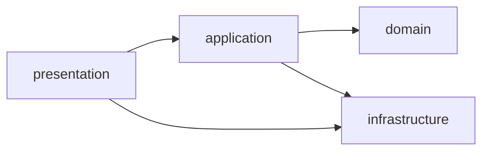
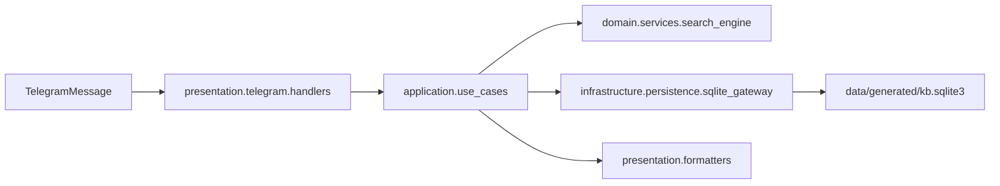

# Architecture Guide

## Layer Boundaries

- `presentation` depends on `application`, `domain`, and `infrastructure` adapters.
- `application` depends on `domain` and infrastructure interfaces/adapters used by use-cases.
- `domain` is framework-agnostic and contains core business rules.
- `infrastructure` contains external systems integration details (SQLite, parsers, logging, Telegram-related adapters).

## Dependency Direction

## Runtime Flow

## Data Lifecycle

- `data/raw_exports` - immutable source exports from Telegram and external dumps.
- `data/seed` - canonical static seed knowledge base.
- `data/generated` - generated QA reports and runtime SQLite database.
- `archive/candidates_for_review` - non-runtime artifacts preserved for manual review.

## Compatibility Policy

- Legacy `app/*` remains as import shims to support existing commands and migration safety.
- All new code should be added under `src/tgtaps_support_bot/*`.
- New tests should be created in `tests/unit/*` or `tests/integration/*`.
